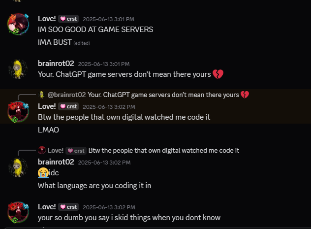
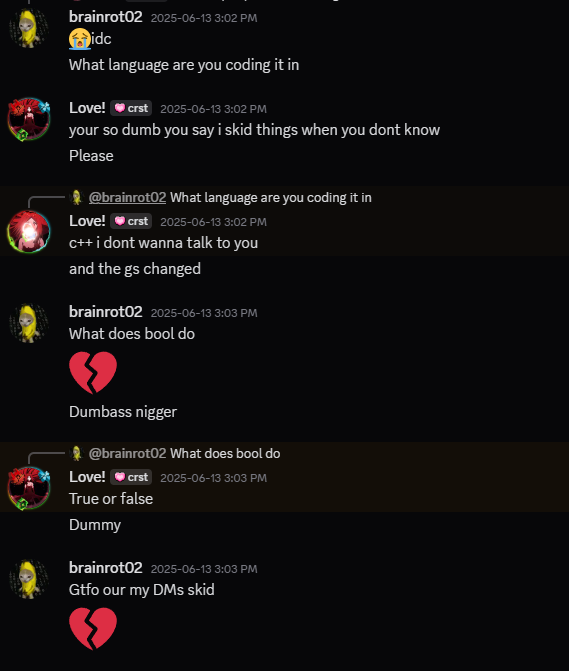
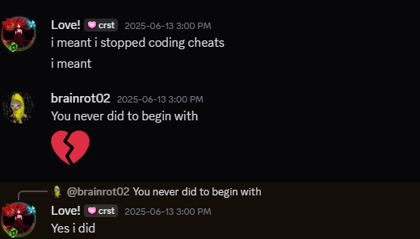
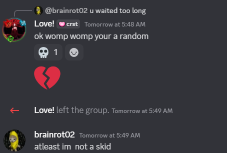

# 🌪️ The Return of Trixy... the *infamous skid* 🤡

Once again, we’re here — watching Trixy fumble through basic questions, dodge accountability, and expose himself without anyone even trying.
😄
---

### ❓ Dodging Simple Questions  
Asked him straight — he dipped harder than his game’s FPS.  

---

### 🤖 Responding to gibberish lmfao
When you don't know, just say whatever you want 💀  

---

### 📩 Admitting to Pasting  
"i made it"  
*Also him:*  

---

### 🤯 Doesn’t Know His Own Game Server is in JavaScript  
Brother thinks he's running C++ when it's a straight-up JS kiddy template 😭  
  

---

### 🧠 Classic Skid Behavior  
Just more proof. Dude can’t script his way out of Notepad.  

---

### 🕵️‍♂️ “your unknown” — Bro, *Nobody* Knows You  
You're not shadowy or mysterious. You're just irrelevant.  

---

### 🎥 Caught in 4K  
Avoids voice chat questions like he avoids actual coding.  
> **Streamable Proof:** [https://streamable.com/5l6lur](https://streamable.com/5l6lur) (caught in 480p 😭)

---

**Summary:**  
Trixy is what happens when Google, GitHub, and delusion collide. No rep, no skills, just chilling and VSCode open for no reason.
Don't go to him for any backends, gs, etc. Everything he claims to do is either chatgpt or someones publicly available work.

Anyways LETHAL on top!
